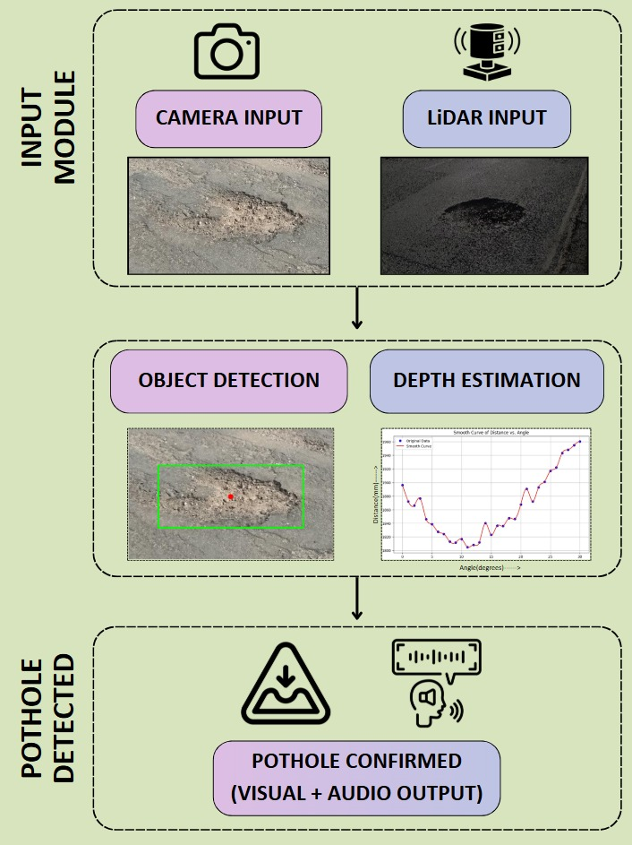
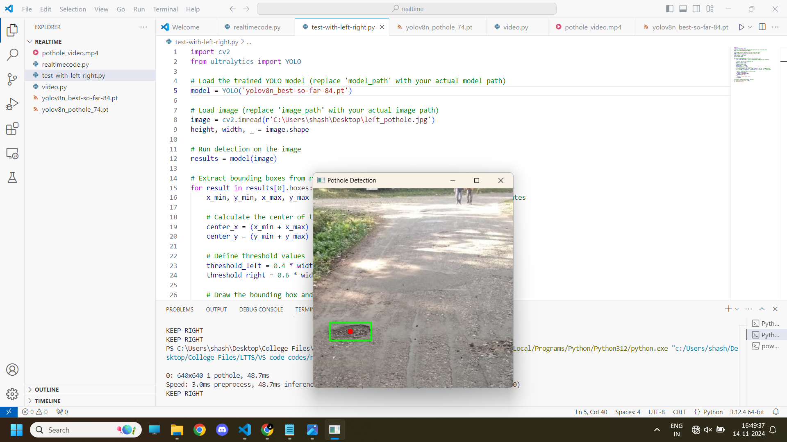
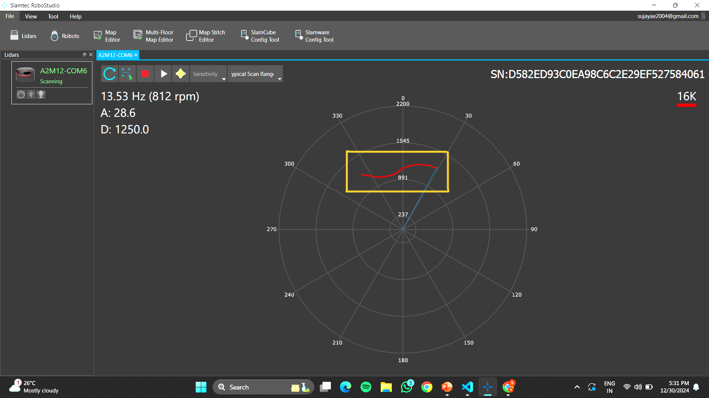

# Real-Time Pothole Detection and Mitigation System

An advanced pothole detection framework that integrates YOLOv8n-based visual detection with LiDAR-based depth sensing to ensure accurate identification of potholes under various lighting conditions. The system offers immediate audio and visual alerts, optimizing both driver safety and infrastructure planning.

---

## Overview

This system addresses the rising concerns related to road hazards by detecting potholes in real-time using a pipelined dual-sensor approach. It is designed for embedded deployment, optimized for low latency, and is capable of operating reliably in both bright daylight and low-light/night conditions.

---

## System Block Diagram

---

## Key Features

- **Real-time Detection:** Fast YOLOv8n inference ensures potholes are identified without delay.
- **Depth Validation:** LiDAR helps differentiate actual potholes from surface cracks or bumps.
- **Low-Light Compatibility:** Tuned image processing pipeline supports detection in challenging lighting environments.
- **Driver Feedback:** Visual overlays and voice commands guide drivers to avoid road damage.
- **Optimized Synchronization:** LiDAR and camera data are time-aligned for coherent results.

---

## System Architecture

### YOLOv8-based Visual Detection
- Lightweight `YOLOv8n` model used for detecting pothole regions in video frames.
- Chosen for its efficiency on edge devices without significant loss in accuracy.

### LiDAR-based Depth Analysis
- Filters out false positives by checking the depth profile of detected regions.
- Thresholding is applied to ignore shallow defects and confirm pothole severity.

---

## Voice and Visual Feedback

- **Audio Output:** Example – “Pothole at Left, Keep Right.”
- **Camera Output:** Bounding boxes around detected potholes.
- **LiDAR Output:** Depth profiles displayed alongside visual detections.

---

## Optimization Highlights

- Tuned LiDAR distance thresholds for accurate pothole depth classification.
- Synchronized LiDAR and camera streams to align detections spatially and temporally.
- Chose YOLOv8n for minimal latency with acceptable detection performance.

---

---

## Conclusion

The system successfully merges real-time object detection and LiDAR depth filtering to create a robust, deployable pothole detection solution. It significantly enhances on-road safety and offers potential integration into larger smart infrastructure systems for automated maintenance tracking and city planning.

---

## Teammates
- [Royston Vedamuthu](https://github.com/RoystonV)
- [Anirudh Navalgund](https://github.com/Anirudh-Navalgund)
- [E Sujaya](https://github.com/Sujaya-E)
